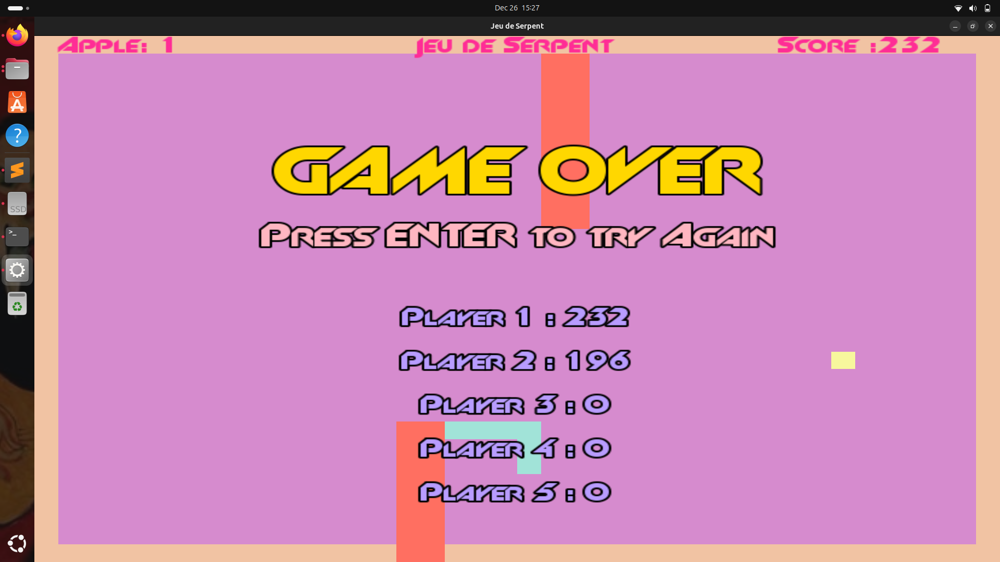

# Snake Game - SFML

A classic Snake game implementation built with SFML (Simple and Fast Multimedia Library) in C++.

## Features

- **Dynamic Snake**: Snake spawns at a random position on the game board
- **Obstacle System**: Two random obstacles appear on screen each game
- **Wall Wrapping**: Snake can pass through walls and emerge from the opposite side
- **Collision Detection**: Game ends when snake hits obstacles or itself
- **High Score System**: Tracks and displays best scores with competitive scoring mechanics

## Game Mechanics

### Snake Movement
- Snake starts at a random position on the game field
- Use arrow keys (or WASD) to control the snake's direction
- Snake grows in length as it eats food

### Obstacles
- Two random obstacles are placed on the game field at the start of each game
- Colliding with any obstacle results in game over

### Wall Wrapping
- Snake can move through the edges of the screen
- When the snake exits one side, it appears on the opposite side

### Scoring System
- Players earn points by eating food
- **Competitive High Score List**: To get on the leaderboard, you must beat the current lowest high score
- Only scores that exceed the lowest score in the high score list are added
- When a new high score is achieved, it's placed at the top and the lowest score is removed
- This creates a competitive environment where you must continuously improve to maintain your position

## Controls

- **Arrow Keys** or **WASD**: Control snake direction
- **ESC**: Exit game
- **R**: Restart game (if implemented)

## Technical Details

- Built with SFML library
- Written in C++
- Real-time collision detection
- Dynamic object placement system

## Installation & Running

1. Make sure you have SFML installed on your system
2. Clone this repository:
   ```bash
   git clone https://github.com/az-maa/SnakeGame.git
   cd snake-game-sfml
   ```
3. Compile the project:
   ```bash
  g++ SnakeGame.cpp Draw.cpp input.cpp Engine.cpp SnakeSection.cpp update.cpp Wall.cpp Apple.cpp Obstacle.cpp -o SnakeGameApp -lsfml-graphics -lsfml-window -lsfml-system
   ```
4. Run the game:
   ```bash
  ./SnakeGameApp
   ```

## Dependencies

- SFML 2.5+ (Graphics, Window, System modules)
- C++ compiler with C++11 support or higher

## Screenshots




## Acknowledgments

This project was developed as part of a learning exercise, following online tutorials for the basic SFML setup and game structure. The obstacle system, wall wrapping, and competitive scoring mechanics were implemented as additional features.

## Future Improvements

- [ ] Add sound effects
- [ ] Implement different difficulty levels
- [ ] Add power-ups
- [ ] Improve graphics and animations
- [ ] Add pause functionality

## License


**Note**: This project was created for educational purposes and incorporates concepts learned from SFML tutorials.
